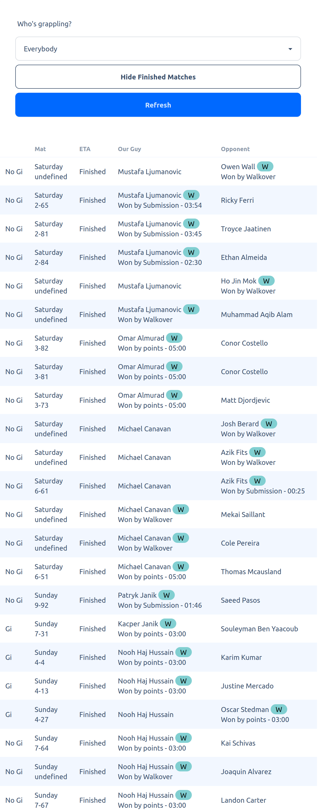

# Grappling Match Tracker

This project is a PoC (Proof of Concept) web application built with Svelte that allows users to track grappling matches on tournament day. It utilizes a Go backend for data fetching. The purpose of this application is to provide a more user-friendly and efficient interface for viewing match brackets compared to smoothcomp's own UI, which is known for its slow performance and lack of mobile optimization.

## Features

- Select a specific participant or view all participants
- Toggle visibility of finished matches
- Refresh data with a single click
- View matches in a time table

## Project Structure

The project is divided into three main parts:

1. `HomePage.svelte`: This is the main Svelte component. It handles user interactions and data querying. Svelte is configured to generate a folder of static files.

2. Go backend: This is a separate service that fetches data for the frontend. It scrapes smoothcomp and uses goroutines to parallelize large queries.

3. Redis: Used for caching results. Since matches update frequently, we set a 10s expiry on cached data. 

All three services run in Docker containers and are organized with docker-compose. 

## Running the Project

To run the project, you need Docker installed on your machine. Then, follow these steps:

1. Clone the repo
2. `docker-compose up`
3. Open your browser and navigate to `http://localhost`.

## Screenshots

## Notes

I rushed to develop and deploy this project just two days before the tournament. Due to time constraints, I had to compromise on some best practices to ensure its usability before the deadline. The project currently includes several hardcoded values that should be modified for future tournaments or to support participants from other gyms. Additionally, further investigation is needed for the Docker deployment configuration, as the default network appeared to fail on AWS EC2 instances.

Additionally, the nature of web-scraping typically necessitates frequent adjustment to the scraping logic, so I fully expect this scraping code will not fully suffice for future tournaments. Excited to see how it will work all the same.  